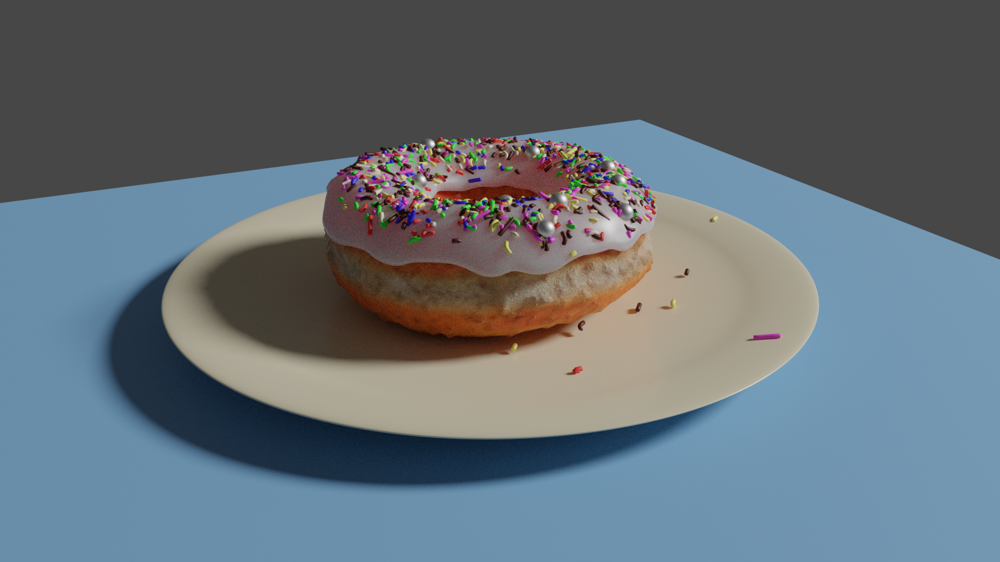

# blender-Donut

A blender tutorial walk through creation of a donut...

I tried to pimp the scene with some creations of my own, leveraging things I've learned so far...

## Preview (WIP)

## Based on

### YouTube Tutorial

* https://www.youtube.com/playlist?list=PLjEaoINr3zgEq0u2MzVgAaHEBt--xLB6U

